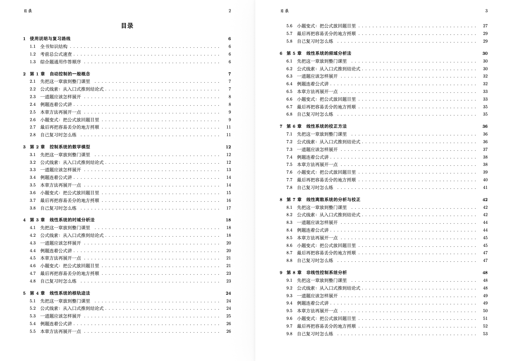
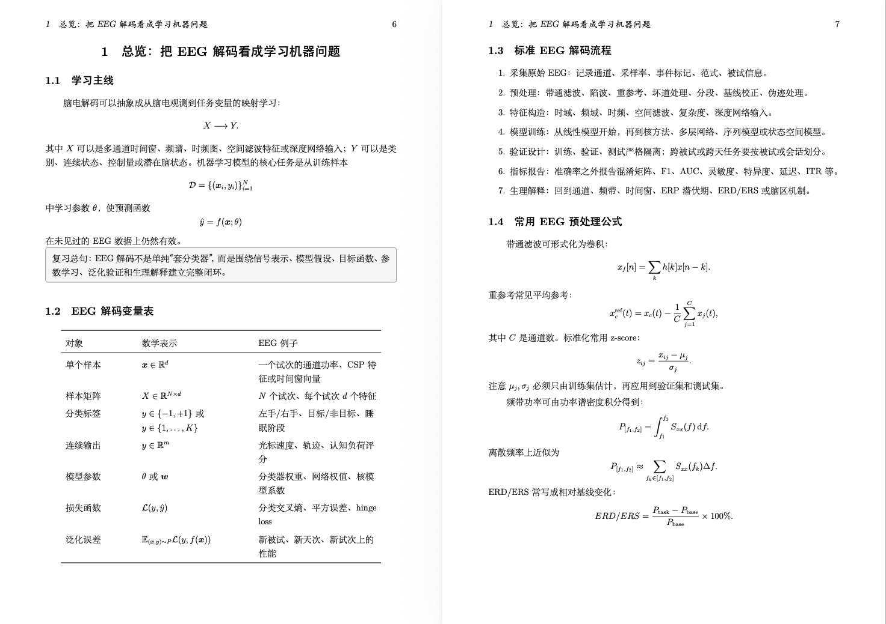
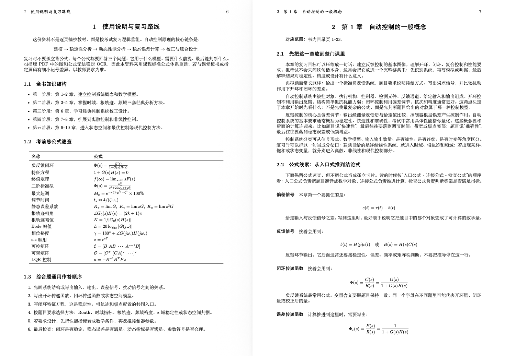
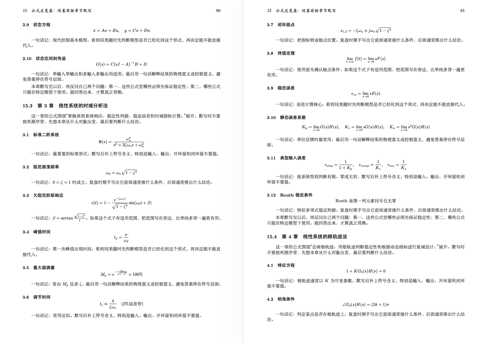

# PDF Document Organization

当你期末复习专业课的时候，看着几千页可能从来不会翻看的天书（当然也可能不是医学生～），网上也没有相应的整理过的专业课资料（谁叫你学的太小众呢？）。博主这学期学了一门课叫做脑机接口，除了一本教材啥都没有～。让codex在整理的时候常常会出现一些奇奇怪怪的格式：要么公式没渲染，要么大小分不清，主次不分明。所以我觉得在期末周给大家分享一下这个skill是很有必要的

这个skill不是“简单总结 PDF”，而是把原始 PDF 重新组织成可复习、可检索、公式尽量完整、结构清晰的资料。输出格式、详细程度、章节安排、是否包含公式、例题、表格、目录、页码依据，都由你在 Prompt 中指定。

## 能做什么

- 按你给定样板整理 PDF，而不是固定套模板。
- 从 PDF 中逐页抽取文本，保留页码线索，便于核对公式、表格和图示。
- 生成中文复习资料、课程讲义、详细笔记、章节摘要、公式手册、题目整理等。
- 对公式密集材料，优先保留 LaTeX 公式；不确定的位置标注原 PDF 页码，避免乱编。
- 可输出 Markdown、LaTeX、PDF，也可以先生成适合转 Word 的 DOCX-ready 文本。

### 目录样板



### EEG 解码笔记样板



### 自动控制复习资料样板



### 公式总复盘样板



## 目录结构

```text
skills/pdf-custom-notes/
├── SKILL.md
├── agents/
│   └── openai.yaml
└── scripts/
    ├── extract_pdf_text.py
    └── notes_md_to_pdf.py
```

## 安装方式

把 `skills/pdf-custom-notes` 复制到本机 Codex skills 目录：

```bash
mkdir -p "${CODEX_HOME:-$HOME/.codex}/skills"
cp -R skills/pdf-custom-notes "${CODEX_HOME:-$HOME/.codex}/skills/"
```

之后在 Codex 里可以直接使用：

```text
使用 $pdf-custom-notes 把这个 PDF 整理成我指定格式的详细复习资料。
```

## 推荐 Prompt

### 详细考试复习资料

```text
使用 $pdf-custom-notes 整理这个 PDF。

要求：
1. 输出中文考试复习资料，不要写成一章一句话的摘要。
2. 目标长度约 80-120 页，按课程章节重组。
3. 每章包含：学习主线、核心概念、重要公式、公式变量解释、适用条件、常见题型、解题步骤、易错点、复习建议。
4. 公式必须尽量完整，用 LaTeX 表示；如果 PDF 提取不清楚，标注“公式见原 PDF 第 N 页”，不要乱补。
5. 不要直接照抄原文，要用适合复习的语言重新组织。
6. 最终生成 PDF；如果更适合先生成 Word，也可以先输出 DOCX-ready 文本。
```

### 按样板生成讲义

```text
使用 $pdf-custom-notes 整理这个 PDF，并参考我给的样板风格。

要求：
1. 先做目录，目录要体现每章下的固定学习模块。
2. 正文采用“标题 + 解释 + 公式 + 表格 + 一句话记忆 + 易错提醒”的讲义形式。
3. 公式居中排版，表格用于整理变量、对象、条件和结论。
4. 语言要像考试复习资料，不要像论文综述。
5. 章节之间允许重新组织，但必须覆盖原 PDF 的主要知识点。
```

### 公式总复盘

```text
使用 $pdf-custom-notes 把这个 PDF 整理成公式复盘资料。

要求：
1. 按章节列出核心公式。
2. 每个公式包含：公式本体、变量含义、使用条件、典型题目入口、常见错误。
3. 对相似公式做对比表，说明什么时候用哪个。
4. 公式不要缺项，不能确定的地方标注原 PDF 页码。
```


## 脚本说明

### `extract_pdf_text.py`

逐页抽取 PDF 文本，并生成：

- `*.pages.json`：结构化页级文本和抽取元数据。
- `*.pages.txt`：带 `=== Page N ===` 标记的可读文本。

示例：

```bash
python skills/pdf-custom-notes/scripts/extract_pdf_text.py \
  "/abs/source.pdf" \
  --out-dir "/abs/work-dir" \
  --basename "source_extracted"
```

### `notes_md_to_pdf.py`

把 Markdown 笔记转换为中文友好的 LaTeX 文件，并可选择调用 `tectonic` 编译。

示例：

```bash
python skills/pdf-custom-notes/scripts/notes_md_to_pdf.py \
  "/abs/notes.md" \
  --title "课程复习资料" \
  --source "source.pdf" \
  --out-dir "/abs/output-dir" \
  --compiler none
```

## 质量要求

使用这个 skill 时，建议始终检查：

- 目录是否像真正的复习资料，而不是机械罗列章节。
- 每章是否包含解释、公式、变量含义、条件、题型和易错点。
- 公式是否完整，符号是否前后一致。
- 表格是否帮助比较和记忆，而不是为了排版硬塞。
- PDF 输出是否存在中文乱码、公式溢出、表格断裂或页码异常。
